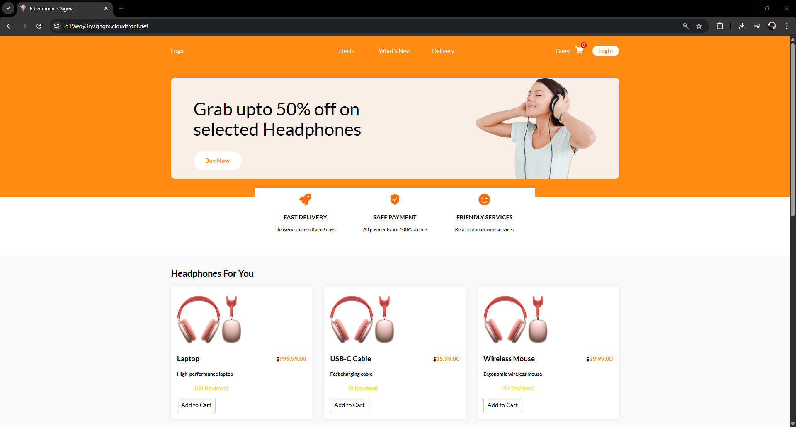
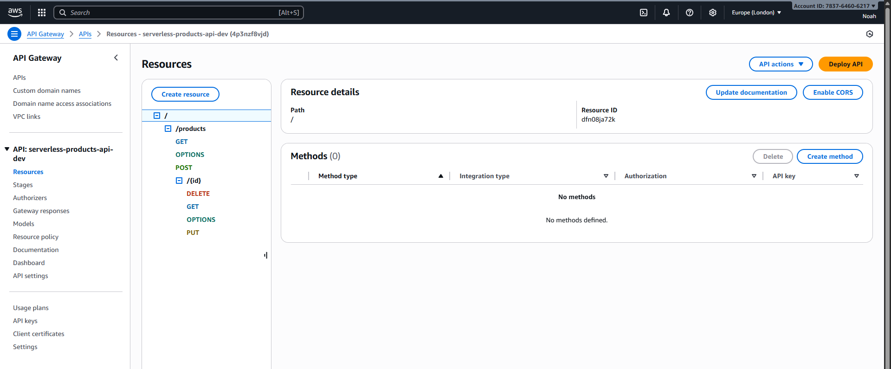
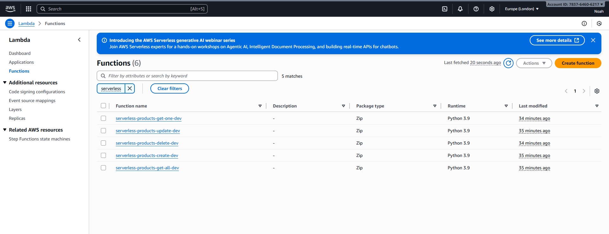
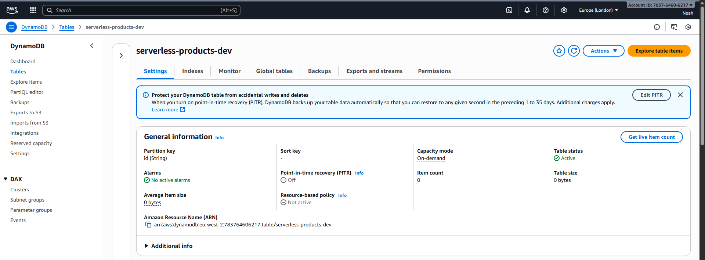
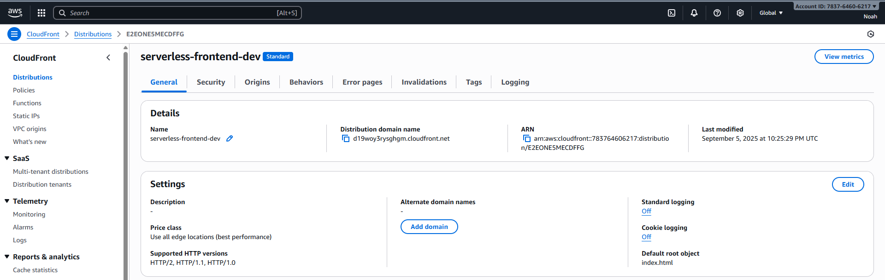
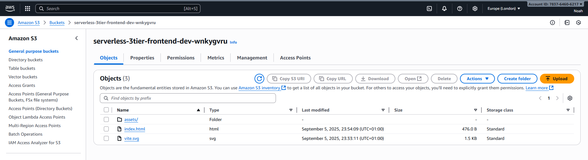
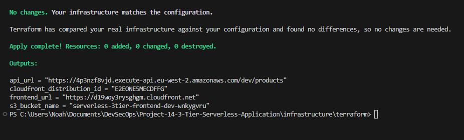
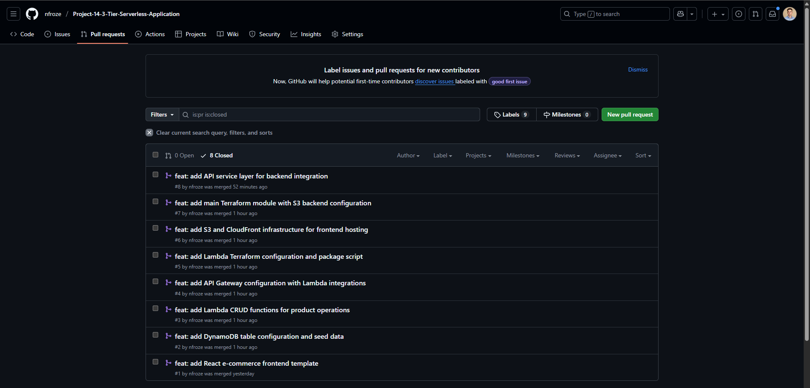

# Project 14: 3-Tier Serverless Application

Full-stack serverless e-commerce application with React frontend on S3/CloudFront, Lambda functions via API Gateway, and DynamoDB database. Infrastructure as Code with Terraform.

## Technologies

AWS Lambda • API Gateway • DynamoDB • S3 • CloudFront • React • Terraform • Python • Node.js • Git

## Screenshots

